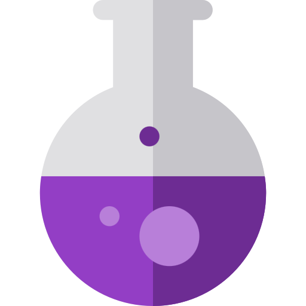

# micromana

  

micromana help you track the miriad microtasks that drain your mana daily and share it with your micromanager to justify why you did not have enough time to do more of the never ending work they assign to you.

## Download

**[Latest release (GitHub)](https://github.com/geoter/micromana/releases/latest)** — download **`micromana-macos-1.0.0.zip`**, unzip, and drag **`micromana.app`** into **Applications**.

The same zip is also in the repo at [`docs/releases/micromana-macos-1.0.0.zip`](docs/releases/micromana-macos-1.0.0.zip).

## Requirements

- macOS 13+
- Xcode 15+ (recommended)

`Package.swift` defines a tiny placeholder library only so SwiftPM can parse the repo; **build the app with Xcode**, not `swift build`.

## Build & run

1. Open `Micromana.xcodeproj` in Xcode.
2. Select the **Micromana** scheme and **My Mac**.
3. **Product → Run** (⌘R).

The app runs as a menu bar-only app (no Dock icon). Look for the potion icon in the menu bar.

## Usage

- **Left-click** the icon: start tracking; click again to stop and enter a task description (type or use **Record voice** after setting your ElevenLabs API key in **Settings**).
- **Right-click** the icon: **today’s mana** progress bar (remaining vs budget), **Show reports…** (chart of mana consumed per day), **Settings**, **Quit**. In **Reports**, use **Export CSV for today…** to save a minimal CSV of that day’s task entries.

## Data & privacy

Tasks and settings are stored under Application Support (`Micromana` folder in your user Library). Microphone access is requested only when you use voice transcription.

## ElevenLabs

Speech-to-text uses the ElevenLabs [Speech to Text API](https://elevenlabs.io/docs/overview/capabilities/speech-to-text) (`scribe_v2` model). Add your API key in **Settings**.
